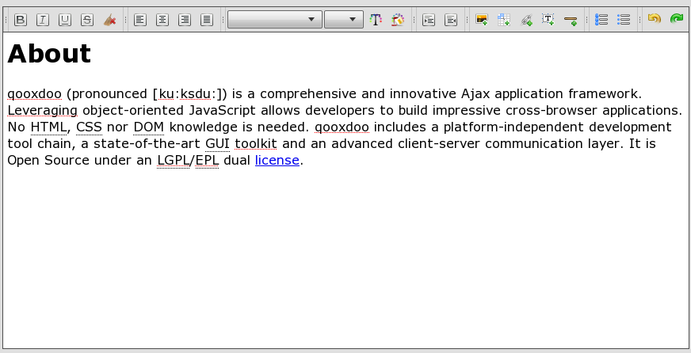

HTML Editing
************

HtmlArea is a html editing widget which is part of the framework. This widget is available as and implementation. The first targets traditional webpages / single-page applications and the latter Rich Internet Applications (RIA) as preferred usecase.

Here you can find some interesting technical info.

Please keep in mind that the HtmlArea component provides basic HTML editing functionality. It is **not** a full-blown HTML editor and will not be developed towards it.

Demo
====

.. _pages/ui_html_editing#setup:

Setup
=====

One important step is necessary to get the HtmlArea up and running. 

If you setup the component without handing the **source** parameter you have to place a **blank.html** file next to your applications **index.html**.

This is necessary due the `Same-Origin Policy <http://en.wikipedia.org/wiki/Same_origin_policy>`_ implemented by most browsers.

Features
========

   Feature List <ui_html_editing/featurelist>
   Technical Feature List <ui_html_editing/technicalfeaturelist>

Integration Guide
=================

   Integrate the HtmlArea in your application <ui_html_editing/integration_guide>
   Available keyboard shortcuts <ui_html_editing/available_shortcuts>
   Recommendations <ui_html_editing/recommendations>

Technical Background
====================

   General information about HTML Editing <ui_html_editing/html_editing_in_general>
   Copy and Paste <ui_html_editing/copy_and_paste>
   Text Align <ui_html_editing/textalign>
   Browser Bugs <ui_html_editing/browser_bugs>
   Default Paragraph Handling <ui_html_editing/default_paragraph_handling>

Implementation Details
======================

   Undo and Redo <ui_html_editing/undo_redo>
   Paragraph Handling <ui_html_editing/paragraph_handling>
   List Handling <ui_html_editing/list_handling>

